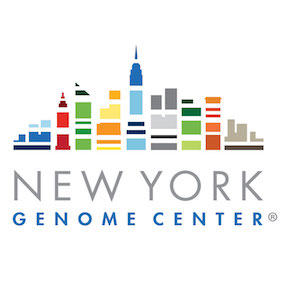

### WOMEN IN STEM LEADERSHIP CAREER NIGHT!!!!!



## Below are some suggestions for how to get started or get more exposure to bioinformatics and programming.

## Installing software so you can write and run code

For help installing Python try the Software Carpentry instructions
- follow the sections for the "Bash Shell" and "Python"
http://installation.software-carpentry.org


## Getting started with the UNIX SHELL 

1) To open a terminal
- Mac: Applications -> Utilities -> Terminal 
-  Windows: start > git bash

2) You need to download some files to follow this lesson:
- Download shell-novice-data.zip and move the file to your Desktop. http://swcarpentry.github.io/shell-novice/data/shell-novice-data.zip
- Unzip/extract the file. You should end up with a new folder called data-shell on your Desktop.

You will often use a terminal (like the one you just opened) when 
working on University clusters or running common bioinformatic 
tools. You can even run your own python programs in a shell session!

Software carpentry has a great introduction to the Unix shell. I 
would highly recommend checking this out even if your main goal
is to learn python.

http://swcarpentry.github.io/shell-novice/

## Getting started with Python!!!!

Again--like a broken record--I would recommend the Software Carpentry 
lessons on Python. Like most of their material they do not assume you
have any knowledge of programming. Even so the lessons will bring
you up to speed and teach you a really clean style that future you 
will really dig. Things like "functions" and "assert" statments can 
really class up your code.

1) To open a terminal
- Mac: Applications -> Utilities -> Terminal 
-  Windows: start > git bash

2) Follow these steps to download and move your data to the correct location: http://swcarpentry.github.io/python-novice-inflammation/setup/

3) Read and try the exercises at: http://swcarpentry.github.io/python-novice-inflammation/

## Extra stuff

You can also download this material. It is in a git repository (repo). This
is a common way scientist share code. If you download this repo you will find 
one small program. To download open a terminal and type:

```
git clone https://github.com/JenniferShelton/nygc-stem.git

~/nygc-stem/nygc_stem.py

# this will also work
~/nygc-stem/nygc_stem.py more
```

## Extra programming!!!

> Rosalind has tons of fun exercises and they will check your answers for you! http://rosalind.info/problems/locations/

1) You can start in the python village (to get more basic practice)

2) Then try the longer exercises in the bioinoformatics armory
- hint: press "click to expand" in the upper corner to learn the biology behind the code in the armory 
